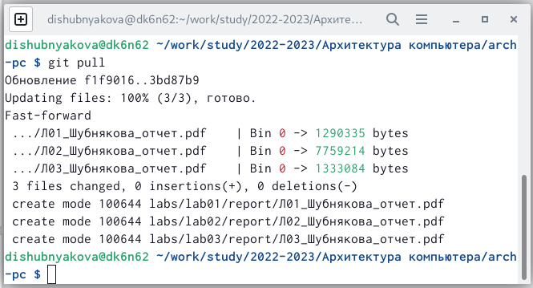
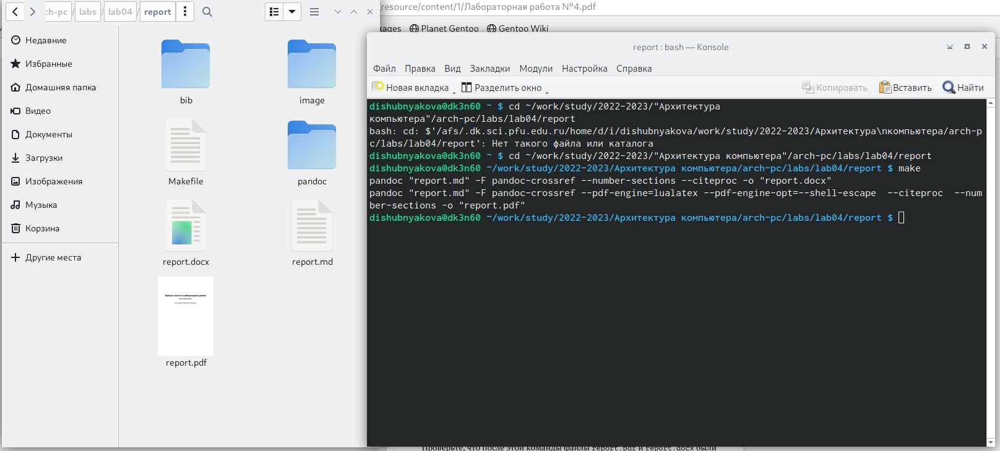
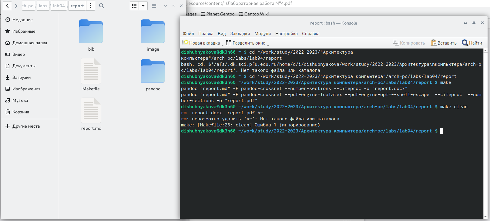

---
## Front matter
title: "Лабораторная работа №4"
subtitle: "НКАбд-03-22"
author: "Шубнякова Дарья"

## Generic otions
lang: ru-RU
toc-title: "Содержание"

## Bibliography
bibliography: bib/cite.bib
csl: pandoc/csl/gost-r-7-0-5-2008-numeric.csl

## Pdf output format
toc: true # Table of contents
toc-depth: 2
lof: true # List of figures
lot: true # List of tables
fontsize: 12pt
linestretch: 1.5
papersize: a4
documentclass: scrreprt
## I18n polyglossia
polyglossia-lang:
  name: russian
  options:
	- spelling=modern
	- babelshorthands=true
polyglossia-otherlangs:
  name: english
## I18n babel
babel-lang: russian
babel-otherlangs: english
## Fonts
mainfont: PT Serif
romanfont: PT Serif
sansfont: PT Sans
monofont: PT Mono
mainfontoptions: Ligatures=TeX
romanfontoptions: Ligatures=TeX
sansfontoptions: Ligatures=TeX,Scale=MatchLowercase
monofontoptions: Scale=MatchLowercase,Scale=0.9
## Biblatex
biblatex: true
biblio-style: "gost-numeric"
biblatexoptions:
  - parentracker=true
  - backend=biber
  - hyperref=auto
  - language=auto
  - autolang=other*
  - citestyle=gost-numeric
## Pandoc-crossref LaTeX customization
figureTitle: "Рис."
tableTitle: "Таблица"
listingTitle: "Листинг"
lofTitle: "Список иллюстраций"
lotTitle: "Список таблиц"
lolTitle: "Листинги"
## Misc options
indent: true
header-includes:
  - \usepackage{indentfirst}
  - \usepackage{float} # keep figures where there are in the text
  - \floatplacement{figure}{H} # keep figures where there are in the text
---

# Цель работы

Целью работы является освоение процедуры оформления отчетов с помощью
легковесного языка разметки Markdown.

# Задание

Сделать отчет по лабораторной работе №3 в формате Markdown.
Предоставить отчет в трех форматах: pdf, docx и md.
Загрузить файлы на github.

# Теоретическое введение

Markdown — язык текстовой разметки, созданный писателем и блогером Джоном Грубером. Он предназначен для создания красиво оформленных текстов в обычных файлах формата TXT. Вам не нужны громоздкие процессоры вроде Word или Pages, чтобы создавать документы с жирным или курсивным начертанием, цитатами, ссылками и даже таблицами.
Документы, написанные с использованием синтаксиса Markdown, представляют собой обычные текстовые файлы TXT. Их можно открыть на любой платформе и в любом редакторе. Этим они выгодно отличаются от файлов, созданных в текстовых процессорах. 

# Выполнение лабораторной работы

В самом начале переходим в каталог курса, созданный в предыдущей работе и обновляем локальный репозиторий с помощью команды git pull. (рис. [-@fig:001])

{ #fig:001 width=70% }

Затем производим компиляцию шаблона report.md с использованием Makefile. Поскольку компиляция в терминале долго не производилась, я перешла в консоль, где спустя время были успешно сгенерированы необходимые файлы в формате pdf и docx. После чего я убедилась в их корректности. (рис. [-@fig:002])

{ #fig:002 width=70% }

Далее удаляем созданные файлы и убеждаемся в том, что они отсутствуют. (рис. [-@fig:003])

{ #fig:003 width=70% }

В конце работы с данным отчетом он будет скомпилирован в три необходимых формата и загружен на github с помощью команд, описанных в восьмом пункте лабораторной работы.

# Выводы

В ходе работы мы познакомились с понятием компиляции файлов и языком текстовой разметки Markdown. Также мы освоили базовый синтаксис этого языка, с помощью которого  впоследствии написали данный отчет.

# Список литературы{.unnumbered}

::: {#refs}
:::
