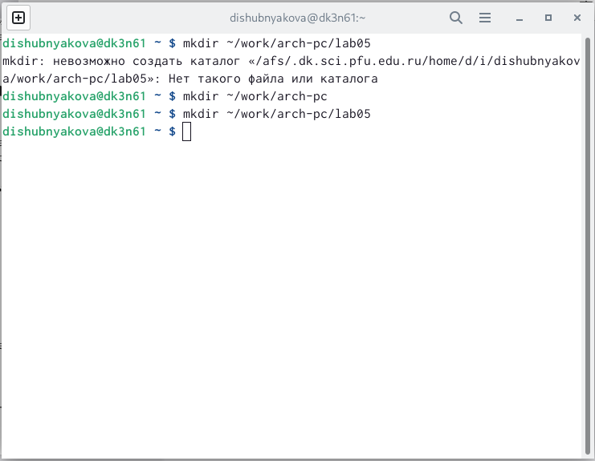
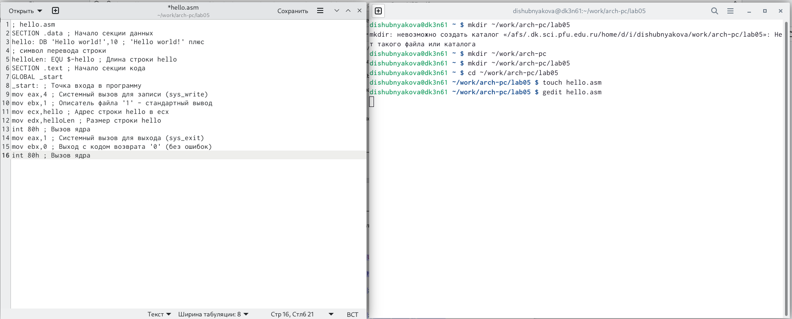
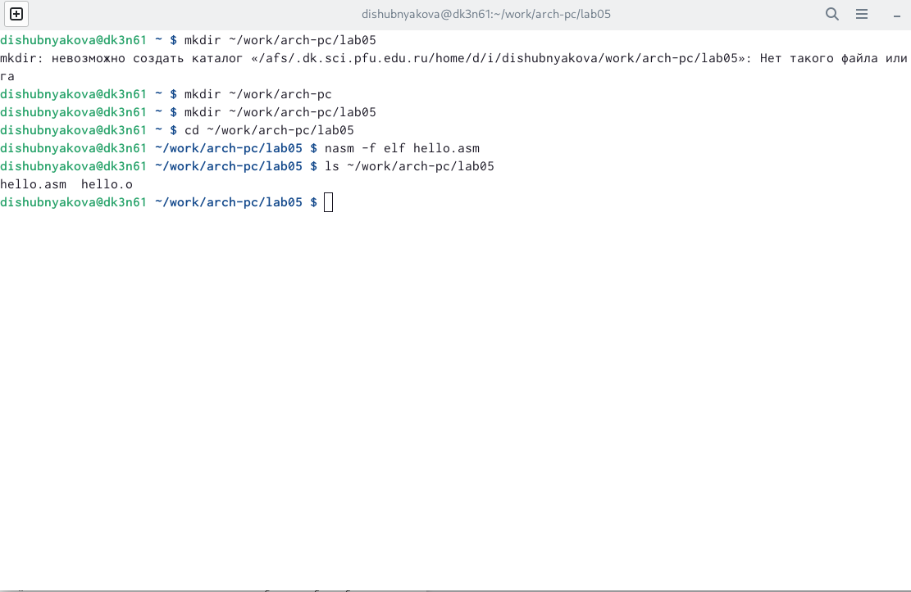
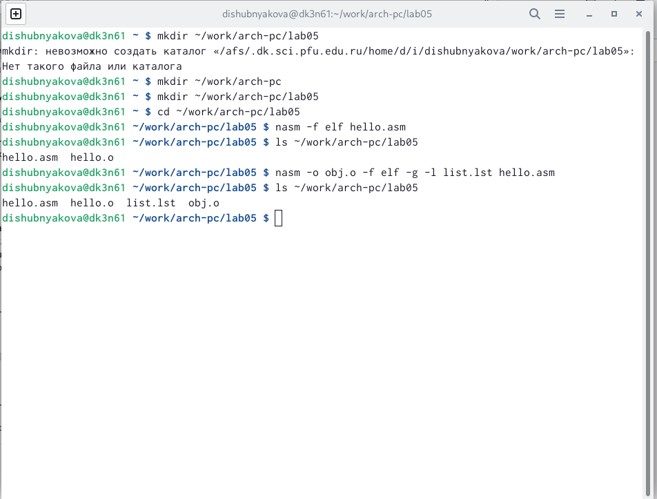
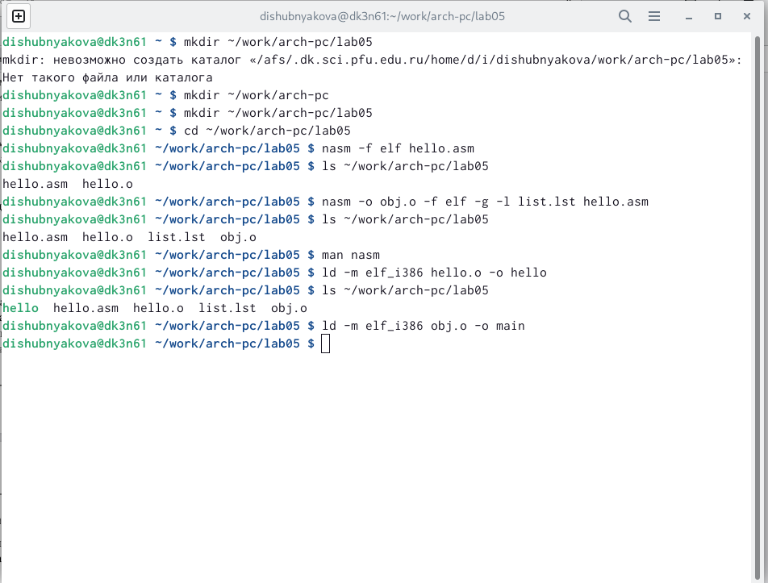
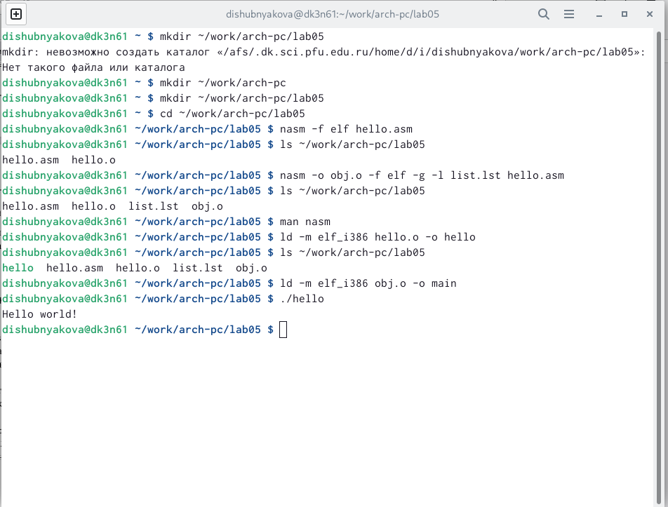
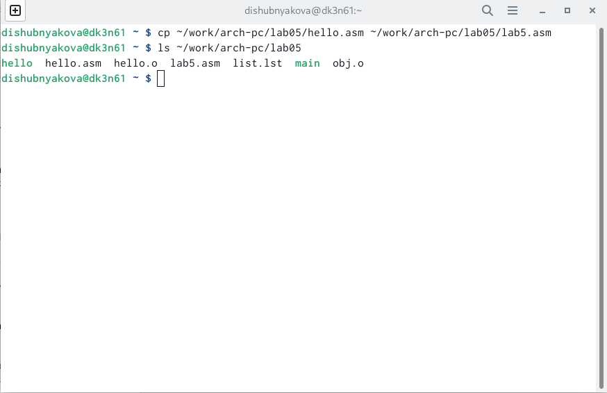
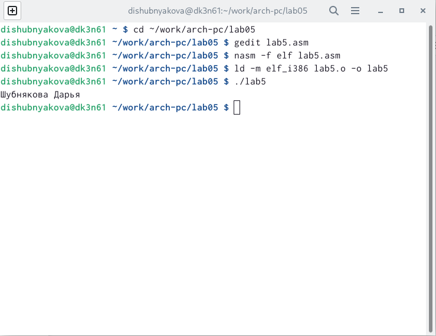
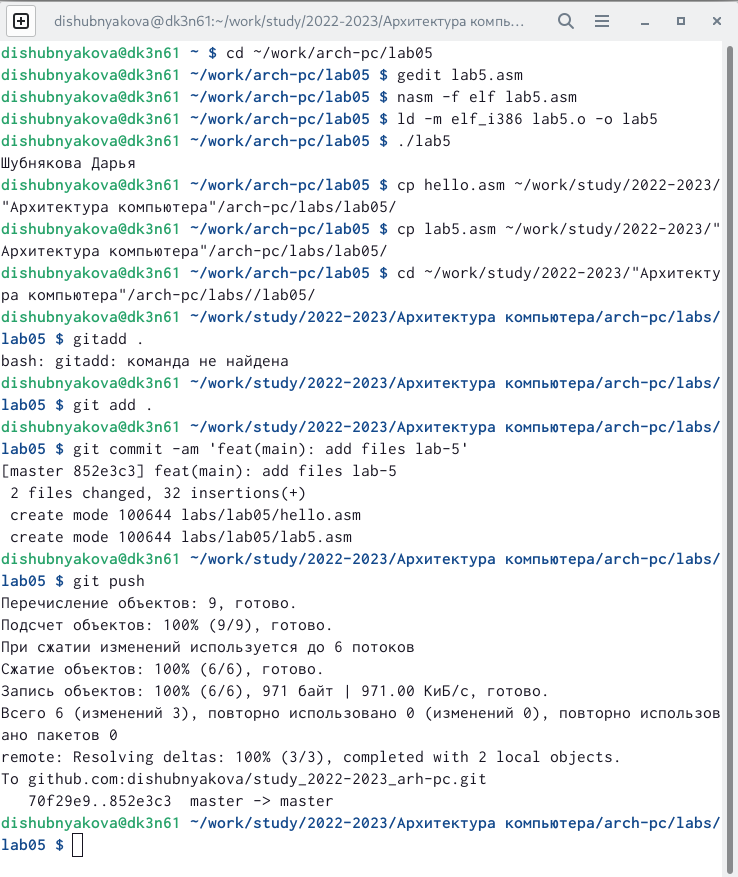

---
## Front matter
title: "Лабораторная работа №5"
subtitle: "НКАбд-03-22"
author: "Шубнякова Дарья"

## Generic otions
lang: ru-RU
toc-title: "Содержание"

## Bibliography
bibliography: bib/cite.bib
csl: pandoc/csl/gost-r-7-0-5-2008-numeric.csl

## Pdf output format
toc: true # Table of contents
toc-depth: 2
lof: true # List of figures
lot: true # List of tables
fontsize: 12pt
linestretch: 1.5
papersize: a4
documentclass: scrreprt
## I18n polyglossia
polyglossia-lang:
  name: russian
  options:
	- spelling=modern
	- babelshorthands=true
polyglossia-otherlangs:
  name: english
## I18n babel
babel-lang: russian
babel-otherlangs: english
## Fonts
mainfont: PT Serif
romanfont: PT Serif
sansfont: PT Sans
monofont: PT Mono
mainfontoptions: Ligatures=TeX
romanfontoptions: Ligatures=TeX
sansfontoptions: Ligatures=TeX,Scale=MatchLowercase
monofontoptions: Scale=MatchLowercase,Scale=0.9
## Biblatex
biblatex: true
biblio-style: "gost-numeric"
biblatexoptions:
  - parentracker=true
  - backend=biber
  - hyperref=auto
  - language=auto
  - autolang=other*
  - citestyle=gost-numeric
## Pandoc-crossref LaTeX customization
figureTitle: "Рис."
tableTitle: "Таблица"
listingTitle: "Листинг"
lofTitle: "Список иллюстраций"
lotTitle: "Список таблиц"
lolTitle: "Листинги"
## Misc options
indent: true
header-includes:
  - \usepackage{indentfirst}
  - \usepackage{float} # keep figures where there are in the text
  - \floatplacement{figure}{H} # keep figures where there are in the text
---

# Цель работы

Освоение процедуры компиляции и сборки программ, написанных на ассем-
блере NASM.

# Задание

1) В каталоге ~/work/arch-pc/lab05 с помощью команды cp создайте копию
файла hello.asm с именем lab5.asm
2) С помощью любого текстового редактора внесите изменения в текст про-
граммы в файле lab5.asm так, чтобы вместо Hello world! на экран выво-
дилась строка с вашими фамилией и именем.
3) Оттранслируйте полученный текст программы lab5.asm в объектный
файл. Выполните компоновку объектного файла и запустите получивший-
ся исполняемый файл.
4) Скопируйте файлы hello.asm и lab5.asm в Ваш локальный репозиторий
в каталог ~/work/study/2022-2023/"Архитектура компьютера"/arch-
pc/labs/lab05/. Загрузите файлы на Github.

# Теоретическое введение

Основными функциональными элементами любой электронно-вычислительной
машины (ЭВМ) являются центральный процессор, память и периферийные
устройства.
Взаимодействие этих устройств осуществляется через общую шину, к которой
они подключены. Физически шина представляет собой большое количество проводников, соединяющих устройства друг с другом. В современных компьютерах
проводники выполнены в виде электропроводящих дорожек на материнской
(системной) плате.

Язык ассемблера (assembly language, сокращённо asm) — машинно-
ориентированный язык низкого уровня. Можно считать, что он больше любых
других языков приближен к архитектуре ЭВМ и её аппаратным возможностям,
что позволяет получить к ним более полный доступ, нежели в языках высокого
уровня, таких как C/C++, Perl, Python и пр. Заметим, что получить полный доступ
к ресурсам компьютера в современных архитектурах нельзя, самым низким
уровнем работы прикладной программы является обращение напрямую к ядру операционной системы. Именно на этом уровне и работают программы, написанные на ассемблере. Но в отличие от языков высокого уровня ассемблерная
программа содержит только тот код, который ввёл программист. Таким образом
язык ассемблера — это язык, с помощью которого понятным для человека
образом пишутся команды для процессора.
Следует отметить, что процессор понимает не команды ассемблера, а последовательности из нулей и единиц — машинные коды. До появления языков
ассемблера программистам приходилось писать программы, используя только
лишь машинные коды, которые были крайне сложны для запоминания, так как
представляли собой числа, записанные в двоичной или шестнадцатеричной
системе счисления. Преобразование или трансляция команд с языка ассемблера в исполняемый машинный код осуществляется специальной программой
транслятором — Ассемблер.

# Выполнение лабораторной работы

Создаем каталог для работы с программами на языке ассемблера NASM. Поскольку в папке work не было каталога arch-pc, я создаю также и его.(рис. [-@fig:001])

{ #fig:001 width=70% }

Создаем текстовый файл hello.asm и открываем его с помощью текстового редактора. Вставляем туда текст из заданной лабораторной работы и сохраняем файл.(рис. [-@fig:002])

{ #fig:002 width=70% }

Превращаем наш текст в объектный код с помощью транслятора NASM. С помощью команды ls проверяем его наличие и видим, что название созданного объектного файла hello.o.(рис. [-@fig:003])

{ #fig:003 width=70% }

Выполняем заданную в работе команду, которая компилирует исходный файл с определнным именем obj.o в формате elf, где будут включены символы для отладки и создан файл листинга. С помощью команды ls снова проверяем правильность выполненных действий.(рис. [-@fig:004])

{ #fig:004 width=70% }

Передаем наш объектный файл на обработку компоновщику LD, чтобы получить исполняемую программу. Проверяем, что файл успешно создан. Затем выполняем команду из заданной работы. Имя исполняемого файла будет main, а объектный файл, из которого он собран, называется obj.o(рис. [-@fig:005])

{ #fig:005 width=70% }

Запускаем наш файл и убеждаемся в его работе.(рис. [-@fig:006])

{ #fig:006 width=70% }

С помощью команды cp копируем файл hello.asm с новым именем lab5.asm и убеждаемся в том, что он был создан.(рис. [-@fig:007])

{ #fig:007 width=70% }

С помощью текстового редкатора меняем "Hello world!" на имя и фамилию. После того как файл был оттранслирован в объектный файл и затем откомпонован, запускаем и видим строку с именем и фамилией.(рис. [-@fig:008])

{ #fig:008 width=70% }

Копируем файлы в наш локальный репозиторий и загружаем их на github.(рис. [-@fig:009])

{ #fig:009 width=70% }

# Выводы

Процесс создания ассемблерной программы включает в себя набор текста, трансляцию, компановку и запуск. В ходе работы мы прошли через все этапы и познакомились с тем, как это реализуется через терминал.

# Список литературы{.unnumbered}

::: {#refs}
:::
