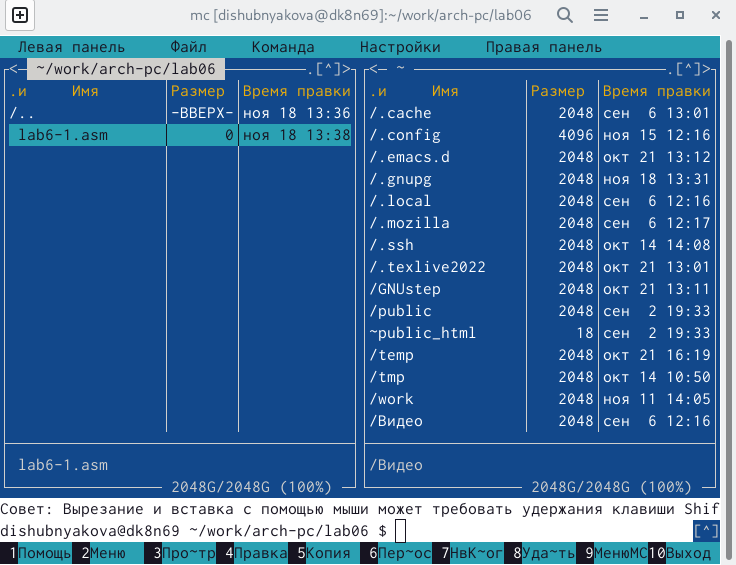
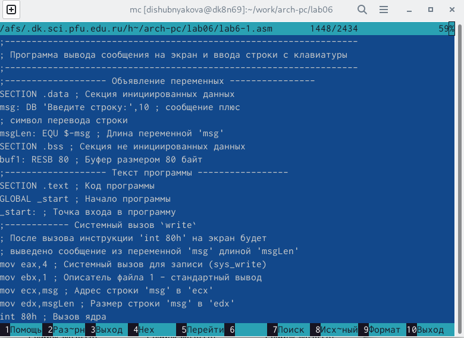
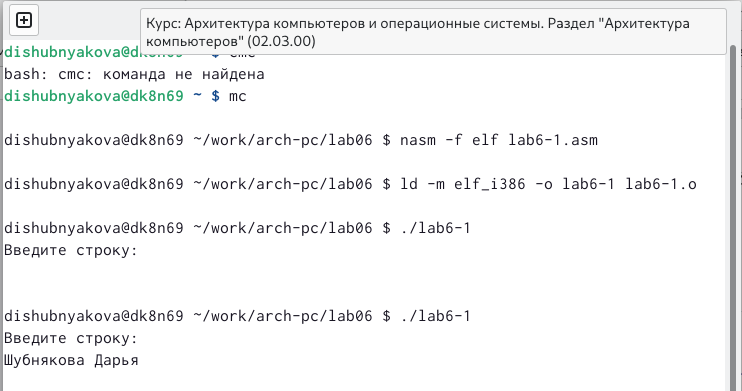
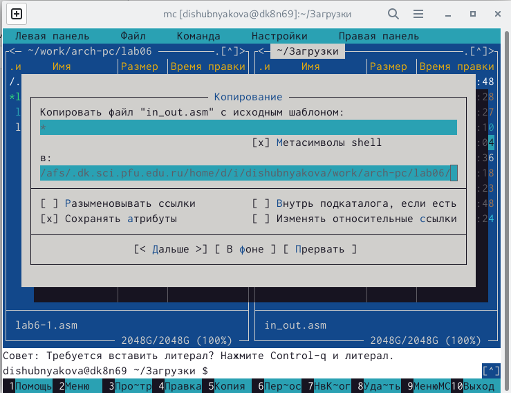
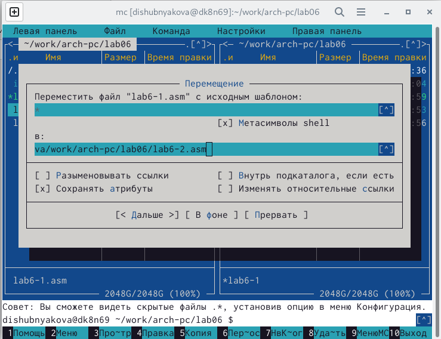
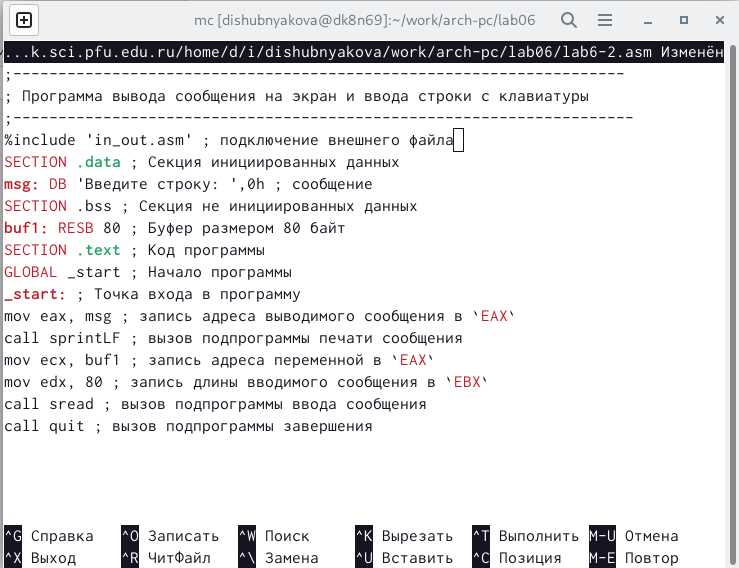
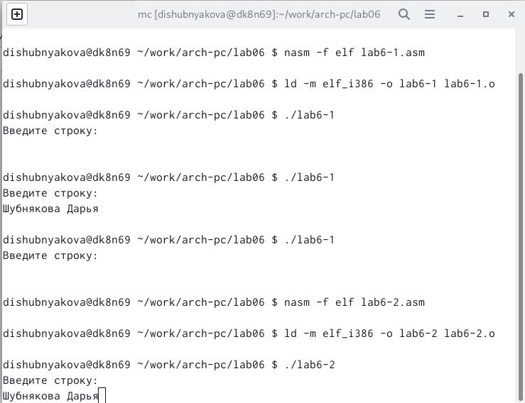
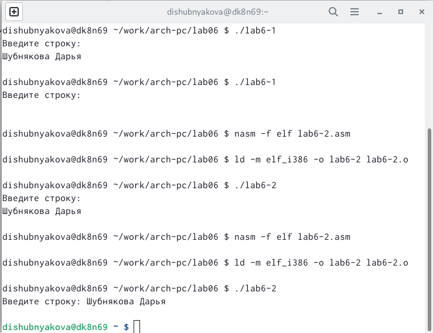

---
## Front matter
title: "Лабораторная работа №6"
subtitle: "НКАбд-03-22"
author: "Шубнякова Дарья"

## Generic otions
lang: ru-RU
toc-title: "Содержание"

## Bibliography
bibliography: bib/cite.bib
csl: pandoc/csl/gost-r-7-0-5-2008-numeric.csl

## Pdf output format
toc: true # Table of contents
toc-depth: 2
lof: true # List of figures
lot: true # List of tables
fontsize: 12pt
linestretch: 1.5
papersize: a4
documentclass: scrreprt
## I18n polyglossia
polyglossia-lang:
  name: russian
  options:
	- spelling=modern
	- babelshorthands=true
polyglossia-otherlangs:
  name: english
## I18n babel
babel-lang: russian
babel-otherlangs: english
## Fonts
mainfont: PT Serif
romanfont: PT Serif
sansfont: PT Sans
monofont: PT Mono
mainfontoptions: Ligatures=TeX
romanfontoptions: Ligatures=TeX
sansfontoptions: Ligatures=TeX,Scale=MatchLowercase
monofontoptions: Scale=MatchLowercase,Scale=0.9
## Biblatex
biblatex: true
biblio-style: "gost-numeric"
biblatexoptions:
  - parentracker=true
  - backend=biber
  - hyperref=auto
  - language=auto
  - autolang=other*
  - citestyle=gost-numeric
## Pandoc-crossref LaTeX customization
figureTitle: "Рис."
tableTitle: "Таблица"
listingTitle: "Листинг"
lofTitle: "Список иллюстраций"
lotTitle: "Список таблиц"
lolTitle: "Листинги"
## Misc options
indent: true
header-includes:
  - \usepackage{indentfirst}
  - \usepackage{float} # keep figures where there are in the text
  - \floatplacement{figure}{H} # keep figures where there are in the text
---

# Цель работы

Приобретение практических навыков работы в Midnight Commander. Освоение
инструкций языка ассемблера mov и int.

# Задание

Создать два исполняемых файла. Один с использованием подпрограмм из внешнего файла, второй -- без.

# Теоретическое введение

Midnight Commander (или просто mc) — это программа, которая позволяет
просматривать структуру каталогов и выполнять основные операции по управ-
лению файловой системой, т.е. mc является файловым менеджером. Midnight
Commander позволяет сделать работу с файлами более удобной и наглядной.

Программа на языке ассемблера NASM, как правило, состоит из трёх секций:
секция кода программы (SECTION .text), секция инициированных (известных
во время компиляции) данных (SECTION .data) и секция неинициализирован-
ных данных (тех, под которые во время компиляции только отводится память,
а значение присваивается в ходе выполнения программы) (SECTION .bss).

Для объявления инициированных данных в секции .data используются ди-
рективы DB, DW, DD, DQ и DT, которые резервируют память и указывают, какие
значения должны храниться в этой памяти. Директивы используются для объявления простых переменных и для объявления массивов. Для определения строк принято использовать директиву DB в
связи с особенностями хранения данных в оперативной памяти. Для объявления неинициированных данных в секции .bss используются директивы resb, resw, resd и другие, которые сообщают ассемблеру, что необходимо зарезервировать заданное количество ячеек памяти.

Инструкция языка ассемблера mov предназначена для дублирования данных
источника в приёмнике. 

Инструкция языка ассемблера intпредназначена для вызова прерывания с
указанным номером. В общем виде она записывается в виде int n. 

Простейший диалог с пользователем требует наличия двух функций — выво-
да текста на экран и ввода текста с клавиатуры. Простейший способ вывести
строку на экран — использовать системный вызов write. Этот системный вызов
имеет номер 4, поэтому перед вызовом инструкции int необходимо поместить
значение 4 в регистр eax. Первым аргументом write, помещаемым в регистр
ebx, задаётся дескриптор файла. Для вывода на экран в качестве дескриптора
файла нужно указать 1 (это означает «стандартный вывод», т. е. вывод на экран).
Вторым аргументом задаётся адрес выводимой строки (помещаем его в регистр
ecx, например, инструкцией mov ecx, msg). Строка может иметь любую длину.
Последним аргументом (т.е. в регистре edx) должна задаваться максимальная
длина выводимой строки.
Для ввода строки с клавиатуры можно использовать аналогичный системный
вызов read. Его аргументы – такие же, как у вызова write, только для «чтения»
с клавиатуры используется файловый дескриптор 0 (стандартный ввод).
Системный вызов exit является обязательным в конце любой программы на
языке ассемблер. Для обозначения конца программы перед вызовом инструк-
ции int 80h необходимо поместить в регистр еах значение 1, а в регистр ebx
код завершения 0.

# Выполнение лабораторной работы

Открываем Midnight Commander с помощью команды mcedit. Создаем папку lab06, а в ней файл lab6-1.asm с помощью команды touch. (рис. [-@fig:001])

{ #fig:001 width=70% }

Редактируем файл в соответствии с заданием в редакторе mcedit. Сохраняем файл и закрываем редактор. С помощью клавиши F3 проверяем правильность набранной программы. (рис. [-@fig:002])

{ #fig:002 width=70% }

После того, как мы оттранслировали и провели компановку объектного файла, запускаем исполняемый файл. На запрос "Введите строку" вводим имя и фамилию. (рис. [-@fig:003])

{ #fig:003 width=70% }

Скачиваем внешний файл in_out.asm с подпрограммами и копируем его в наш рабочий каталог. (рис. [-@fig:004])

{ #fig:004 width=70% }

Создаем копию нашего файла с названием lab6-2.asm. (рис. [-@fig:005])

{ #fig:005 width=70% }

Исправляем текст программы в nano на новый с использованием подпрограмм из скачанного ранее файла. Сохраним, оттранлируем и скомпонуем.(рис. [-@fig:006])

{ #fig:006 width=70% }

Запускаем исполняемый файл и проверяем, что все правильно работает. (рис. [-@fig:007])

{ #fig:007 width=70% }

В этом файле меняем подпрограмму sprintLF на sprint. Выполняем те же действия для получения исполняемого файла и проверяем его работу. Замечаем небольшую разницу между двумя этими подпрограммами. При использовании sprintLF после приглашения "Введите строку" был совершен переход на новую строку для пользовательского ввода данных. В случае sprint мы вводим имя и фамилию на этой же строке. (рис. [-@fig:008])

{ #fig:008 width=70% }

# Выводы

Мы познакомились с Midnight Commander (или просто mc). Узнали про структуру программы на языке ассемблера NASM. Прочитали про инструкции mov и int. Использовали внешний файл с подпрограммами для более удоной работы с NASM. 

# Список литературы{.unnumbered}

::: {#refs}
:::
